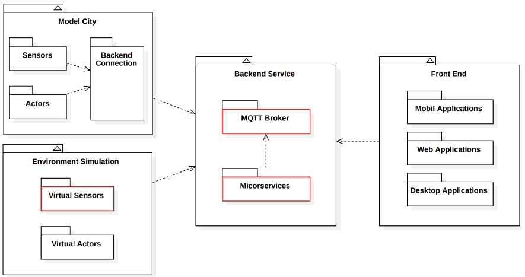
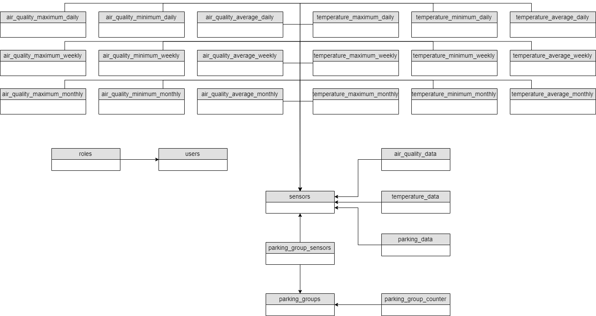
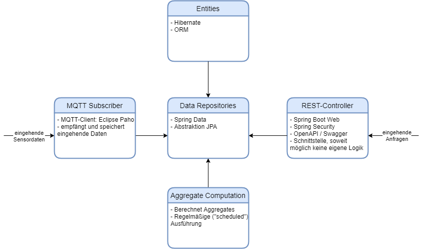
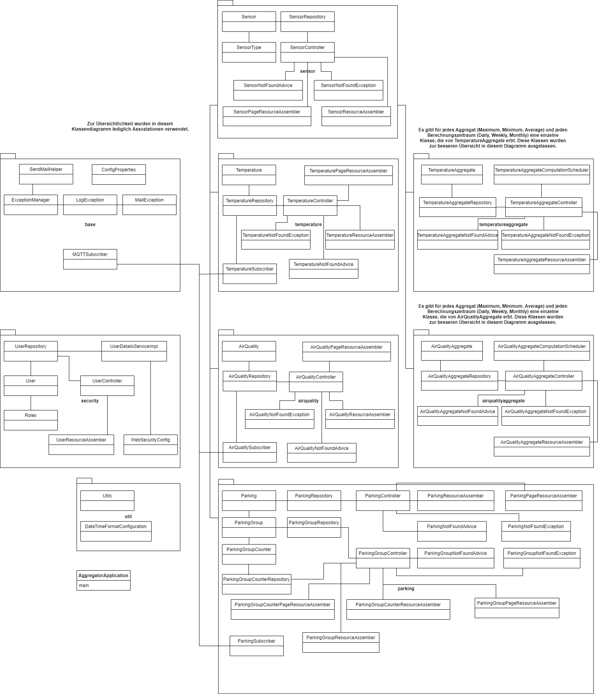
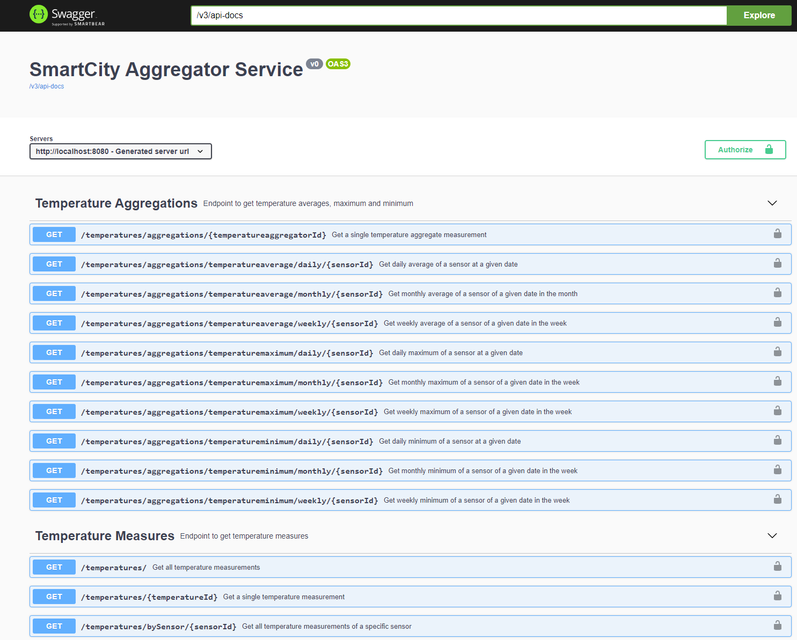
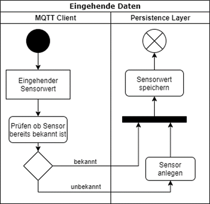

# Aggregator Service
Das Internet of Things (IoT) erhält zunehmend Einzug in Bereiche des Alltags. Insbesondere steigt das Interesse an Smart-City-Anwendungen. Diese sollen Prozesse
im städtischen Umfeld optimieren und durch den Einsatz von intelligenter Hardware das Leben einfacher gestalten. Wesentlicher Bestandteil einer Smart-City-
Infrastruktur stellen Sensoren dar, die verschiedenste Daten messen. Temperatur-, Luftqualität- und Parkplatzdaten sind für das Projekt relevant. 
Um neuste Technologien zu erforschen, wird das SmartCity-Testfeld aufgebaut, welches im Folgenden zu sehen ist.



Der Kern des Systems ist der MQTT-Broker, über den die gesamte Kommunikation abläuft. Er entscheidet, welche Nachrichten an welche Client weitergeleitet werden.

Ein weiterer Bestandteil des Testfelds ist der Aggregrator-Service.
Hierbei handelt es sich um einen auf Spring Boot basierten Cloud-Service, der mit dem MQTT-Broker kommuniziert.
Seine Hauptaufgabe ist die Verarbeitung und Speicherung von Sensormessungen. Aus Messwerten werden Aggregate sowohl in Echtzeit als auch zeitverzögert durch 
Batch-Processing-Routinen gebildet. Über eine REST-Schnittstelle können die Daten abgefragt werden. Dazu wird eine Vielzahl von Endpunkten bereitgestellt, 
mit denen genau die Daten gefiltert werden können, die benötigt werden. Die FrontEnds müssen dann lediglich die Daten im entsprechenden Format anzeigen.

## Architektur
Wie oben beschrieben ist, handelt es sich um einen Microservice, der Teil des Backends ist. Der Aggregator Service ist in seiner Funktionalität abhänig vom MQTT Broker.
Bei der Erarbeitung der Lösungsstrategie musste die Datenverarbeitung der Sensormesswerte festgelegt werden. Als separate Aspekte musste die Batch-Aggregation und
die Datenbereitstellung konzipiert werden. Diese drei Kernfunktionen des Service konnten im Einzelnen konzipiert werden. Im Folgenden werden diese beschrieben.

#### Use Cases / User Stories
* Daten müssen gesammelt und aggregiert werden
* Historische und aktuelle Daten müssen abrufbar sein
* Aktuelle Messwerte und aggregierte Daten müssen abrufbar sein
* Verschiedene Sensordaten müssen modelliert werden
* Es sollen ohne viel Aufwand neue Sensoren hinzugefügt werden können
* Nutzer sollten authentifiziert werden
* Nutzer sollten von Fehlersituationen benachrichtigt werden

#### Anforderungen

##### Must-Have-Anforderungen:

###### Funktionale Anforderungen:
* Daten sollen Luftqualität, Temperatur und Parkplatzbelegung umfassen 
* Daten sammeln und vereinheitlichen
* Daten in Echtzeit speichern und aggregieren
* Historische Daten aggregieren (Tages-, Wochen-, Monatsaggregate)
* Aggregate sollen Mittelwerte, Minima und Maxima umfassen
* Daten nach verschiedenen Kriterien abrufbar
* Simulator für Sensordaten

###### Nichtfunktionale Anforderungen:
* Microservice bereitstellen
* Containerisierung mit Docker
* Nutzung von Spring
* REST-Schnittstelle zur Bereitstellung verwenden

##### Should-Have-Anforderungen:

###### Funktionale Anforderungen:
* Serverseitige Nutzerverwaltung
* Dynamisch neue Sensordaten anlegen
* Auswertung von Daten bereitstellen


##### Nice-To-Have-Anforderungen:

###### Funktionale Anforderungen:
* E-Mail-Alerts bei Fehlersituationen versenden
* Administrative Verwaltung von Sensoren und Nutzern

###### Nichtfunktionale Anforderungen:
* Hot-/Cold-Store für Datenhaltung einführen


#### Lösungsstrategie
Die Lösung wurde in Java 11 implementiert. eclipse paho wurde eingesetzt,
eine Open-Source-MQTT-Implementierung. Die Bibliothek stellt Logik für Clients,
also Publisher und Subscriber bereit. Im Folgenden wird die Methodik der Umsetzung
beschrieben. Es wurden Sensoren simuliert, die am MQTT-Broker ihre
Daten bereitstellen. Der Aggregator-Service wurde als Microservice implementiert.
Dadurch kann er unabhängig und einfach bereitgestellt und gewartet werden. Er hat
die Aufgabe, Daten vom Broker zu beziehen und zu verarbeiten. Die Speicherung der
Daten erfolgt in einer MySQL-Datenbank. Zur Abbildung der Datenbank-Entitäten
in Java wurde JPA (Java Persistence API) und Hibernate eingesetzt. Bei Hibernate
handelt es sich um ein ORM-Tool. ORM steht für Object-relational mapping, was
eine Technik zur Umwandlung von Daten in Objekte ist.

###### HiveMQ als Plattform und MQTT-Broker
HiveMQ ist eine MQTT-basierte Plattform, welche alle Features von MQTT bereitstellt.
Es wird ein MQTT-Broker zur Verfügung gestellt, der bereit zur Installation
ist. Die Implementierung von HiveMQ deckt alle Features ab, die benötigt werden.
Es werden die verschiedenen QoS-Levels unterstützt, sowie Clean Sessions, LWT
und Topics mit Wildcards. Zudem zeigt ein Benchmark, dass die Implementierung
auch unter großer Last sehr stabil ist. Ein einzelner Server-Cluster kann zehn Millionen
Client-Verbindungen tragen. Der HiveMQ Broker wurde auf einem Server
installiert und konfiguriert. Die Verbindung erfolgt über TLS (Transport Layer Security).
Dadurch wird kryptografische Sicherheit gewährleistet. Gemäß dem (CIA-Prinzips)
sind Bedrohungen festgelegt als Verlust von Vertraulichkeit, Integrität und
Verfügbarkeit. TLS reagiert auf diese, indem es ein Handshake-Protokoll zur Authentifizierung
der Kommunikationspartner und ein Record-Protokoll zur Sicherung
der Datenübertragung implementiert. Zusätzlich zur Authentifizierung
per Username und Passwort wurde auf dem Server ein von einer Zertifizierungsstelle
(Certificate Authority) signiertes Zertifikat installiert. Möchte ein Client eine
Verbindung aufbauen, so muss er eine Truststore Datei (.pem Zertifikat) mitgeben.
Diese beinhaltet Informationen zum Server. Der Server verifiziert den Inhalt der
Datei. Bei erfolgreicher Prüfung akzeptiert er die Verbindung, andernfalls lehnt er
sie ab.

###### Funktionsweise der MQTT-Publisher
Als Sensoren sollen später Raspberry Pis verwendet werden. Diese messen die Temperatur
in Grad Celsius, die Luftqualität und ob ein Parkplatz belegt ist oder nicht.
Die erstellte Simulation bildet das Verhalten der Sensoren ab.
Zur Simulation der Sensoren wurde ein Service erstellt. Dieser baut eine Verbindung
zum MQTT-Broker auf und generiert zufällige, aber realitätsnahe Daten, welche
er dann auf dem jeweiligen Topic publiziert. Dazu wird die Verbindung wie oben beschrieben mit
Username, Password und Zertifikat aufgebaut. Anschließend werden
in kurzen Zeitabständen die verschiedenen Sensordaten erzeugt und bereitgestellt.


###### AggregatorService Echtzeitdatenverarbeitung
Der AggregatorService soll die von den Sensoren bereitgestellten Daten sammeln,
verarbeiten und speichern. Dazu wurden mehrere MQTT-Subscriber entwickelt. Um den Code
schlank und portabel zu halten, wurde ein generischer MQTT-Subscriber entwickelt.
Die abstrakte Klasse ist die Basis für die Logik aller Subscriber. Nach der Konfiguration der Verbindung
und dem Abonnement des jeweiligen Topics wird auf den Eingang einer
Nachricht gewartet. Kommt eine Nachricht an, so wird der Sensor, falls er noch
nicht vorhanden ist, in der MySQL-Datenbank gespeichert. Die empfangenen Daten
werden verarbeitet und es erfolgt das Speichern der Messung mit Zeit und Sensor.
Wie genau die Daten verarbeitet werden, ist vom jeweiligen Sensortyp abhängig.
Bei den Parkplätzen zum Beispiel ist eine zusätzliche Echtzeitverarbeitung sinnvoll,
die über das schlichte Speichern von eingehenden Messdaten hinausgeht. Es ist nur
notwendig Änderungen von Parkplatzbelegungen zu speichern. Zudem wurde Logik
implementiert, die vom Topic auf die Zugehörigkeit eines Sensors zu einer Gruppe
schließt. Eine Gruppe von Parkplatzsensoren kann, z.B. als Parkhaus interpretiert
werden. Es werden in Echtzeit für eine solche Gruppe Zähler erfasst, welche die
aktuell freien und belegten Parkplätze abbilden. Diese Zähler werden, sobald sich
der Status eines Sensors in seiner Gruppe ändert inkrementiert oder dekrementiert
und anschließend gespeichert.

###### AggregatorService Aggregationsroutine
Zusätzlich zu der Verarbeitung in Echtzeit werden in einer separaten Routine Aggregate
der Daten gespeichert. Dazu zählen Mittelwerte, Maxima und Minima. Täglich,
wöchentlich und monatlich werden gespeicherte Daten geladen und Aggregate berechnet.
Diese werden dann wiederum in eigenen Tabellen abgespeichert. Dadurch,
dass diese Daten nicht in Echtzeit aggregiert werden, kann Rechenzeit gespart werden.
Bei den meisten Aggregaten ist es ohnehin nicht notwendig, dass diese unmittelbar
zur Verfügung stehen.

###### Bereitstellung für beliebige FrontEnds
Die in Echtzeit gespeicherten und aggregierten Daten werden mittels einer REST-Schnittstelle
bereitgestellt. Hierbei wurden einfache und komplexe Abfragen implementiert.
Die Auswertung über verschiedene Zeiträume ermöglicht eine umfangreiche
Auswertung der Sensordaten. Verschiedene Filter ermöglichen die Auswahl der
passenden Daten. Es ist beispielsweise möglich nach Sensor oder Sensortyp zu filtern.
Die Daten können in beliegen FrontEnds dargestellt werden. Die FrontEnds
müssen lediglich die Daten abfragen, die für sie relevant sind. Eine Darstellung kann
dann grafisch oder tabellarisch erfolgen.

###### Administrative Verwaltung
Man kann über die REST-Schnittstelle Nutzer anlegen. Bei der Verbindung mit der REST-Schnittstelle wird der erstellte Nutzer authentifiziert. Bei der
Nutzeranlage können auch verschiedene Rollen vergeben werden. Die Admin-Rolle kann auf alle Endpunkte zugreifen, während die User-Rolle nur Daten abfragen kann.
Ebenso ist es für Admins möglich Daten über Endpunkte einzupflegen so, z.B. die Koordinaten der Sensoren. Zudem können Admins die Aggregationsroutine manuell 
starten.

###### Fehlerbehandlung
Im Falle eines Fehlers bei Verbindung, Konfiguration oder Speichern von Metadaten zu Sensoren oder Messwerten werden Admins informiert. Es ist ebenfalls möglich
zusätzliche Mail-Adressen in der Konfigurationsdatei zu hinterlegen, welche zusätzlich benachrichtigt werden. Die verschiedene Fehlermeldungen werden im Programm
gesammelt und mit hilfreichen Informationen angereichert. So wird beispielsweise zu einem Fehler bei dem Einfügen von Messdaten der Sensor, dessen Typ und die
erhaltene Nachricht vermerkt. Die Fehler werden zentral gesammelt und in konfigurierbaren Intervallen an die Mail-Liste versandt. Dadurch kann ein Mail-Spam 
verhindert werden.

#### Statisches Modell
##### ERM-Modell



##### Bausteinsicht
Im Folgenden ist eine grafische Darstellung der Systembausteine und die eingesetzten Technologien und Frameworks zu sehen.


##### Verteilungssicht
Der Aggregator-Service und die Datenbank laufen in separaten Containern auf derselben Maschine. Der MQTT-Broker läuft Remote auf einem anderen System. 
FrontEnds können auf beliebigen Client-Maschinen realisiert werden. 


##### Klassendiagramm



##### API

###### MQTT-Topics
* Main-Topic in Konfigurationsdatei festlegbar
* Temperatur-Topic: /temperature
* Luftqualität-Topic: /airQuality
* Park-Topic: /parking
* Für Parking können Gruppen definiert werden, um ein Parkplatz oder ein Parkhaus zu simulieren:
    /parking/groupName/sensorName


###### Rest
Der Aggregator-Service ist konform mit der OpenAPI-Spezifikation und stellt unter dem Endpunkt
`/swagger-ui.html` eine grafische Oberfläche mit Details zur Spezifikation bereit. Desweiteren
können auf dieser Oberfläche sämtliche Endpunkte ausprobiert werden.

Die JSON-basierte OpenAPI-Spezifikation steht unter `/v3/api-docs` bereit.




#### Dynamisches Modell
###### Verarbeitung von eingehenden Daten


Eine erweiterte Darstellung des Ablaufs bei eingehenden Sensorwerten:


Die oben dargestellten Sequenzdiagramme stellen die Datenverarbeitung und Aggregation in Echtzeit dar. Parallel dazu laufen zwei weitere Routinen.

###### Sensorwertabfrage über REST-Schnittstelle


###### Aggregation
Die Aggregration erfolgt täglich, wöchentlich und monatlich. Es werden die Aggregate, also Minima, Maxima und Mittelwerte berechnet. 
Dazu werden die Daten des Vortags, bzw. der vorigen Woche oder des vorigen Monats analysiert. Die berechneten Aggregate werden in einer eigenen Tabelle gespeichert. 
Diese können wie normale Messwerte über die REST-Schnittstelle abgefragt werden.
Im Falle eines Fehlers hat ein Admin die Möglichkeit die Berechnung zu einem späteren Zeitpunkt manuell zu wiederholen. 
Eine solche Wiederholung kann über einen Endpunkt der REST-Schnittstelle ausgelöst werden.


## Getting Started
Um dieses Projekt lokal aufzusetzen, muss zuerst dieses Git-Repository geklont werden:
````
git clone https://github.com/htw-saar/SmartCityAggregatorService.git
````
Anschließend kann das Projekt in einer beliebigen IDE bearbeitet werden.

Der Build-Prozess ist mit Maven realisiert. Wichtige Phasen:
- `mvn package`: Kompiliert das Projekt, erstellt eine ausführbare `.jar` mit allen benötigten Dependencies
- `mvn install`: Erstellt ein Docker-Image, welches eine JRE sowie die ausführbare `.jar` als Entry-Point enthält. Wird im lokalen Docker Repository abgelegt. 
Ein Docker-Agent muss lokal verfügbar sein, um diese Phase auszuführen.
- `mvn deploy`: Das generierte Docker-Image wird zu der in der `pom.xml` definierten Docker-Registry gepusht.

#### Vorraussetzungen
Es müssen folgende Abhängigkeiten auf dem Rechner installiert sein:
- [JDK 11](https://www.oracle.com/java/technologies/javase-jdk11-downloads.html)
- [Maven](https://maven.apache.org/download.cgi)
- [Docker](https://www.docker.com/get-started) (für Maven Phasen `install`, `deploy`)

#### Installation und Deployment
Das Docker-Image kann mit `docker run {registry}/htw.smartcity/aggregator:1.0-SNAPSHOT` ausgeführt werden, wobei `{registry}`
durch die entsprechende Registry ersetzt werden muss.

Um die MySQL-Datenbank ebenfalls als Container auf demselben Host bereitzustellen ist es erforderlich, via `docker network create --driver bridge {name}` ein Docker-Netzwerk anzulegen und 
beide Container mit diesem Network zu verbinden. Dazu muss der `docker run`-Befehl um `--net={name}` erweitert werden.
Es empfiehlt sich, dem Datenbank-Container explizit einen Namen zu geben, denn dadurch kann der Aggregator-Service die IP auflösen (siehe "Konfiguration").

###### Konfiguration
Sämtliche Konfigurationseigenschaften können entweder in `src/main/resources/application.properties` eingetragen oder beim Erstellen des Containers als Umgebungsvariablen übergeben werden. 
Die wichtigsten Konfigurationseigenschaften sind:
* `BROKER`: URL des MQTT-Brokers mit Protokoll und Port, z.B. `ssl://134.96.216.46:8883`
* `USERNAME`: Username zur Authentifizierung gegenüber dem MQTT-Broker
* `PASSWORD`: Password zur Authentifizierung gegenüber dem MQTT-Broker
* `TOPIC`: MQTT-Topic, welches der Aggregator-Service subskribiert
* `CERTIFICATE`: Pfad zur `truststore.pem` (zur Authentifizierung gegenüber dem Broker). Bitte beachten, dass es sich dabei um den Pfad innerhalb des Containers beachtet, 
falls der Aggregator-Service als Container ausgeführt wird. Die `truststore.pem` sollte in einem Ordner auf dem Host-System liegen und mittels `--volume` 
an den entsprechend konfigurierten Container-internen Pfad gebunden werden. 
* `spring.datasource.url`: JDBC-Url zur Datenbank. Bei der Ausführung der Datenbank als Container im selben Docker-Netzwerk kann anstelle einer IP oder eines 
Hostnamens der Name des entsprechenden Docker-Containers eingetragen werden.
* `spring.datasource.username`: Username zur Authentifizierung gegenüber der Datenbank 
* `spring.datasource.password`: Password zur Authentifizierung gegenüber der Datenbank
* `INITIAL_ADMIN_PASSWORD`: Initiales Admin-Passwort zum Authentifizieren gegenüber der REST-Schnittstelle des Aggregator-Services
* `logging.file.path`: Pfad, unter dem Log-Dateien gespeichert werden sollen. In-Container-Pfad, siehe `CERTIFICATE`
* `MAIL_USERNAME`: Username zur Authentifizierung gegenüber des Mail-Servers
* `MAIL_PASSWORD`: Password zur Authentifizierung gegenüber des Mail-Servers
* `MAIL_LIST`: Kommagetrennte Liste von E-Mail-Adressen, die bei auftretenden Fehlern informiert werden sollen.
* `MAIL_SEND_PERIOD`: Wie oft eventuell auftretende Fehler per E-Mail versendet weren sollen
* `MAIL_SEND_HOST`: Der Mail-Webserver über den die Kommunikation abgewickelt werden soll
* `MAIL_SEND_PORT`: Der Port des Mail-Webservers
* `MAIL_SEND_SENDER`: Der Absender der generierten Mails

## Built With
* [Spring Boot](https://spring.io/projects/spring-boot)  - Framework zur Erstellung von Microservices
* [Eclipse Paho](https://www.eclipse.org/paho/) - MQTT-Client
* [Swagger](https://swagger.io/) / [springdoc](https://springdoc.org/) - OpenAPI-Konforme Schnittstellenspezifikation
* [Maven](https://maven.apache.org/) - Abhängigkeitenverwaltung, Build-Prozess
* [Hibernate](https://hibernate.org/orm/) - Object-Relationales Mapping
* [Spring Data JPA](https://spring.io/projects/spring-data-jpa) - Library zur Datenabfrage  
* [MySQL](https://www.mysql.com/) - Datenbanksystem
* [JUnit](https://junit.org/) - Framework zum Testen
* [H2 Database Engine](https://www.h2database.com/html/main.html) - In-Memory Datenbank
* [Logback](http://logback.qos.ch/) - Integriertes Application Logging
* [Docker](https://www.docker.com/) - Anwendung zur Containervirtualisierung

## License
This project is licensed under the GNU General Public License v3.0

## Acknowledgments
* [Prof. Dr. Markus Esch](https://www.htwsaar.de/htw/ingwi/fakultaet/personen/profile/markus-esch) - Projektbetreuung
* [SystemTechnikLabor der htw saar](https://stl.htwsaar.de/) - Bereitstellen des Servers
* [Baeldung](https://www.baeldung.com/) - Große Auswahl an Spring Boot-fokussierten Guides
* [Sprint Data JPA - Reference Documentation](https://docs.spring.io/spring-data/jpa/docs/1.5.0.RELEASE/reference/html/index.html) - Dokumentation über Spring Data JPA
* [MQTT Version 5.0](https://docs.oasis-open.org/mqtt/mqtt/v5.0/mqtt-v5.0.html) - Vollständige MQTT Dokumentation
* [phpMyAdmin](https://www.phpmyadmin.net/) - Bereitstellung von MySQL-Datenbanken
* [Cron Expression Generator](https://www.freeformatter.com/cron-expression-generator-quartz.html) - Hilfe bei der Erstellung von Cron Expressions für den Scheduler
* [JavaMail](https://javaee.github.io/javamail/) - Java API zum Versenden von Mails
* [Stackoverflow](https://stackoverflow.com/) - :ok_man: