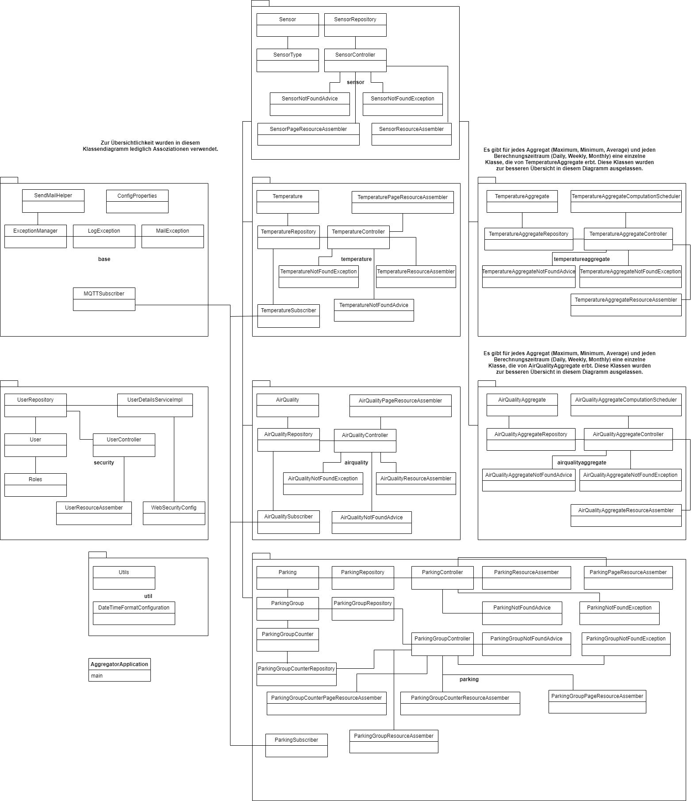
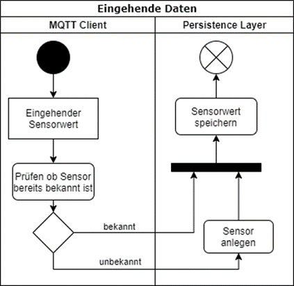
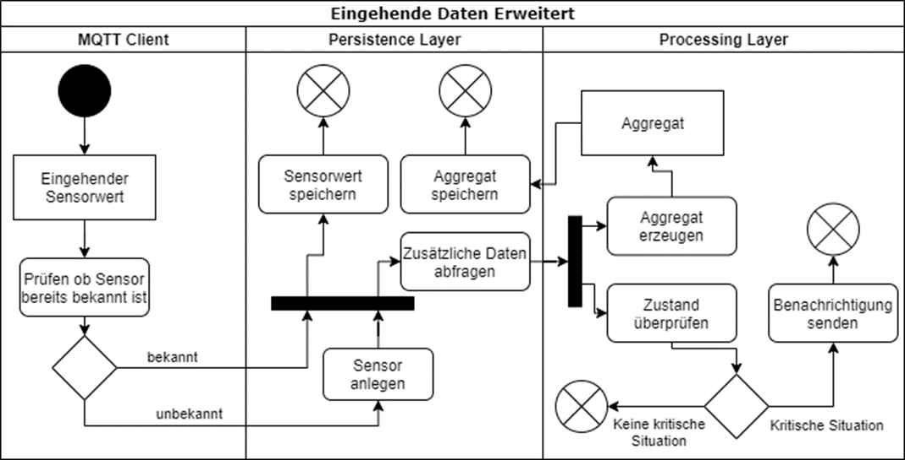
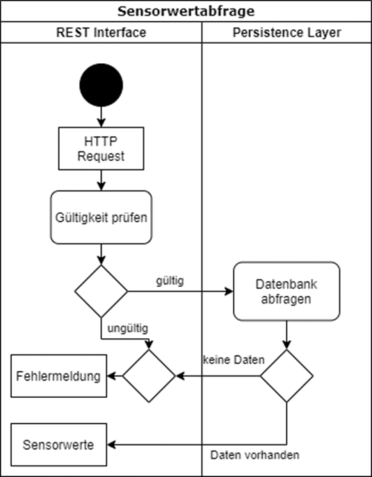

# Aggregator Service
Bei dem Aggregator Service handelt es sich um einen auf Spring Boot basierten Cloud-Service, der Messungen aus einem SmartCity-Testfeld durch einen MQTT-Broker in Echtzeit 
verarbeitet und speichert. Aus Messwerten werden Aggregate sowohl in Echtzeit als auch zeitverzögert durch Batch-Processing-Routinen gebildet. Über eine REST-Schnittstelle 
können die Daten abgefragt werden. Dazu wird eine Vielzahl von Endpunkten bereitgestellt, mit denen genau die Daten gefiltert werden können, die benötigt werden. Die 
FrontEnds müssen dann lediglich die Daten im entsprechenden Format anzeigen.

## Architektur
todo


Stellen Sie die Architektur Ihres Projekts dar. Beginnen Sie mit einem Abschnitt zur Lösungsstrategie.
 D.h. eine kompakte Beschreibung der Kernidee und des Lösungsansatzes. Beschreiben Sie wichtige Designentscheidungen und Begründen Sie diese.

#### Use Cases / User Stories
* Daten müssen gesammelt und aggregiert werden
* Historische und aktuelle Daten müssen abrufbar sein
* Aktuelle Messwerte und aggregierte Daten müssen abrufbar sein
* Verschiedene Sensordaten müssen modelliert werden
* Es sollen ohne viel Aufwand neue Sensoren hinzugefügt werden können
* Nutzer sollten authentifiziert werden
* Nutzer sollten von Fehlersituationen benachrichtigt werden

#### Anforderungen

##### Must-Have-Anforderungen:

###### Funktionale Anforderungen:
* Daten sollen Luftqualität, Temperatur und Parkplatzbelegung umfassen 
* Daten sammeln und vereinheitlichen
* Daten in Echtzeit speichern und aggregieren
* Historische Daten aggregieren (Tages-, Wochen-, Monatsaggregate)
* Aggregate sollen Mittelwerte, Minima und Maxima umfassen
* Daten nach verschiedenen Kriterien abrufbar
* Simulator für Sensordaten

###### Nichtfunktionale Anforderungen:
* Microservice bereitstellen
* Containerisierung mit Docker
* Nutzung von Spring
* REST-Schnittstelle zur Bereitstellung verwenden

##### Should-Have-Anforderungen:

###### Funktionale Anforderungen:
* Serverseitige Nutzerverwaltung
* Dynamisch neue Sensordaten anlegen
* Auswertung von Daten bereitstellen


##### Nice-To-Have-Anforderungen:

###### Funktionale Anforderungen:
* E-Mail-Alerts bei Fehlersituationen versenden
* Administrative Verwaltung von Sensoren und Nutzern

###### Nichtfunktionale Anforderungen:
* Hot-/Cold-Store für Datenhaltung einführen


#### Lösungsstrategie
todo

Geben Sie eine kompakte Beschreibung der Kernidee Ihres Lösungsansatzes. Begründen Sie wichtige Designentscheidungen. Z.B. die Wahl der Middleware, der Programmiersprache, des Architekturansatzes etc.

#### Statisches Modell

###### Bausteinsicht
todo

Die Bausteinsicht beschreibt die logischen Komponenten Ihres Systems und deren Zusammenwirken. Stellen Sie auch die eingesetzte Technologien, Frameworks etc. dar.


###### Verteilungssicht
todo

Die Verteilungssicht stellt dar, auf welchen physischen Rechnern die einzelnen Komponenten Ihres Systems ausgeführt werden und wie diese Verbunden sind.

###### Klassendiagramme



###### API
Der Aggregator-Service ist konform mit der OpenAPI-Spezifikation und stellt unter dem Endpunkt
`/swagger-ui.html` eine graphische Oberfläche mit Details zur Spezifikation bereit. Desweiteren
können auf dieser Oberfläche sämtliche Endpunkte ausprobiert werden.

Die JSON-basierte OpenAPI-Spezifikation steht unter `/v3/api-docs` bereit.


#### Dynamisches Modell
Hier eine simple Darstellung der Verarbeitung von eingehenden Daten:



Eine erweiterte Darstellung des Ablaufs bei eingehenden Sensorwerten:


Die oben dargestellten Sequenzdiagramme stellen die Datenverarbeitung und Aggregation in Echtzeit dar. Parallel dazu laufen zwei weitere Routinen:
* Sensorwertabfrage über REST-Schnittstelle



* Aggregation

    Die Aggregration erfolgt täglich, wöchentlich und monatlich. Es werden die Aggregate, also Minima, Maxima und Mittelwerte berechnet. Dazu werden die Daten des Vortags, bzw. der vorigen Woche oder des vorigen Monats analysiert. Die berechneten Aggregate werden in einer eigenen Tabelle gespeichert. Diese können wie normale Messwerte über die REST-Schnittstelle abgefragt werden.
    Im Falle eines Fehlers hat ein Admin die Möglichkeit die Berechnung zu einem späteren Zeitpunkt manuell zu wiederholen. Eine solche Wiederholung kann über einen Endpunkt der REST-Schnittstelle ausgelöst werden.


## Getting Started
Um dieses Projekt lokal aufzusetzen muss zuerst dieses Git-Repository geklont werden:
````
git clone https://github.com/htw-saar/SmartCityAggregatorService.git
````
Anschließend kann das Projekt in einer beliebigen IDE bearbeitet werden.

Der Buildprozess ist mit Maven realisiert. Wichtige Phasen:
- `mvn package`: Kompiliert das Projekt, erstellt eine ausführbare `.jar` mit allen benötigten Dependencies
- `mvn install`: Erstellt ein Docker-Image, welches eine JRE sowie die ausführbare `.jar` als Entry-Point enthält. Wird im lokalen Docker Repository abgelegt. Ein Docker-Agent muss lokal verfügbar sein, um diese Phase auszuführen.
- `mvn deploy`: Das generierte Docker-Image wird zu der in der `pom.xml` definierten Docker-Registry gepusht.

#### Vorraussetzungen
Es müssen folgende Abhängigkeiten auf dem Rechner installiert sein:
- [JDK 11](https://www.oracle.com/java/technologies/javase-jdk11-downloads.html)
- [Maven](https://maven.apache.org/download.cgi)
- [Docker](https://www.docker.com/get-started) (für Maven Phasen `install`, `deploy`)

#### Installation und Deployment
Das Docker-Image kann mit `docker run {registry}/htw.smartcity/aggregator:1.0-SNAPSHOT` ausgeführt werden, wobei `{registry}`
durch die entsprechende Registry ersetzt werden muss.

Um die MySQL-Datenbank ebenfalls als Container auf dem selben Host bereitzustellen ist es erforderlich, via `docker network create --driver bridge {name}` ein Docker-Netzwerk anzulegen und beide Container mit diesem Netwerk zu verbinden. Dazu muss der `docker run`-Befehl um `--net={name}` erweitert werden.
Es empfiehlt sich, dem Datenbank-Container explizit einen Namen zu geben, denn dadurch kann der Aggregator-Service die IP auflösen (siehe "Konfiguration")

###### Konfiguration
Sämtliche Konfigurationseigenschaften können entweder in `src/main/resources/application.properties` eingetragen, oder beim Erstellen des Containers als Umgebungsvariablen übergeben werden. Die wichtigsten Konfigurationseigenschaften sind:
* `BROKER`: URL des MQTT-Brokers mit Protokoll und Port, z.B. `ssl://134.96.216.46:8883`
* `USERNAME`: Username zur Authentifizierung gegenüber dem MQTT-Broker
* `PASSWORD`: Password zur Authentifizierung gegenüber dem MQTT-Broker
* `TOPIC`: MQTT-Topic, welches der Aggregator-Service subskribiert
* `CERTIFICATE`: Pfad zur `truststore.pem` (zur Authentifizierung gegenüber dem Broker). Bitte beachten, dass es sich dabei um den Pfad innerhalb des Containers beachtet, falls der Aggregator-Service als Container ausgeführt wird. Die `truststore.pem` sollte in einem Ordner auf dem Host-System liegen, und mittels `--volume` an den entsprechend konfigurierten Container-internen Pfad gebunden werden. 
* `spring.datasource.url`: JDBC-Url zur Datenbank. Bei der Ausführung der Datenbank als Container im selben Docker-Netzwerk kann anstelle einer IP oder eines Hostnamens der Name des entsprechenden Docker-Containers eingetragen werden.
* `spring.datasource.username`: Username zur Authentifizierung gegenüber der Datenbank 
* `spring.datasource.password`: Password zur Authentifizierung gegenüber der Datenbank
* `INITIAL_ADMIN_PASSWORD`: Initiales Admin-Passwort zum Authentifizieren gegenüber der REST-Schnittstelle des Aggregator-Services
* `logging.file.path`: Pfad, unter dem Log-Dateien gespeichert werden sollen. In-Container-Pfad, siehe `CERTIFICATE`
* `MAIL_USERNAME`: Username zur Authentifizierung gegenüber des Mail-Servers
* `MAIL_PASSWORD`: Password zur Authentifizierung gegenüber des Mail-Servers
* `MAIL_LIST`: Kommagetrennte Liste von E-Mail-Addressen, die bei auftretenden Fehlern informiert werden sollen.
* `MAIL_SEND_PERIOD`: Wie oft eventuell auftretende Fehler per E-Mail versendet weren sollen


## Built With

* [Spring Boot](https://spring.io/projects/spring-boot)  - Framework zur Erstellung eines Micro Services
* [Eclipse Paho](https://www.eclipse.org/paho/) - The MQTT Client used
* [Swagger](https://swagger.io/) / [springdoc](https://springdoc.org/) - OpenAPI compliant API specification
* [Maven](https://maven.apache.org/) - Dependency Management
* [Hibernate](https://hibernate.org/orm/) - Object-relational mapping
* [Spring Data JPA](https://spring.io/projects/spring-data-jpa) - Library zur Datenabfrage  
* [MySQL](https://www.mysql.com/) - Datenbanksystem
* [JUnit](https://junit.org/) - Framework zum Testen
* [H2 Database Engine](https://www.h2database.com/html/main.html) - Java SQL database
* [Logback](http://logback.qos.ch/) - Integriertes Application Logging

## License
This project is licensed under the GNU General Public License v3.0

## Acknowledgments
todo
* [Prof. Dr. Markus Esch](https://www.htwsaar.de/htw/ingwi/fakultaet/personen/profile/markus-esch) - Projektbetreuung
* [Baeldung](https://www.baeldung.com/) - Große Auswahl an Spring Boot-fokusierten Guides
* [Stackoverflow](https://stackoverflow.com/) - :ok_man: